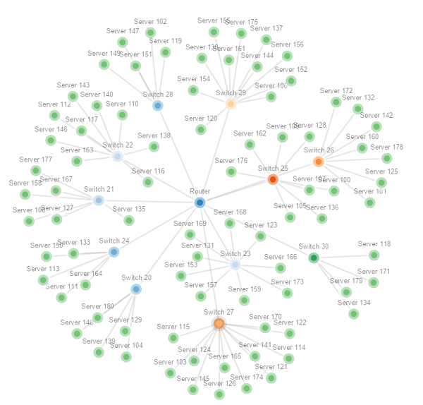

# Posh-NetJson

**Version:** 0.Such.Alpha.1

## Overview
Some simple PowerShell functions to make creating and editing [NetJson](http://netjson.org) files easier. 

Right now only the **NetGraph** and **NetCollection** objects are supported, I'll add more if/when I can use them.

The **New** functions all return custom objects that serialize to/from 'json' with valid NetJson schema.

## Why

I wanted to make cool network graphs with [netjsongraph.js](https://github.com/interop-dev/netjsongraph.js) like this:




## Usage

### Graphs

Create an empty NetGraph.

```powershell

New-NetGraph -Static -label "My Network"

```

### Create Nodes

Create an empty NetGraphNode.

```powershell

New-NetGraphNode -ID 'pswitch' -Label "Primary Switch"

```

Attach Nodes to a Graph:

```powershell

$graph = New-NetGraph -Static -label "My Network"

$graph.nodes += New-NetGraphNode -ID 'router1' -Label "Router" 
$graph.nodes += New-NetGraphNode -ID 'pswitch' -Label "Primary Switch" 

```


### Create Links

Add links to the graph:

```powershell

$graph.links += New-NetGraphLink -Source 'router1' -Target 'pswitch' -Cost 0


```

### Export the graph 

Export the Graph using the standard `ConvertTo-Json` cmdlet. 
The only catch is you need to specify a depth of 5, as the the default depth will populate the properties objects with the type, not the actual object. 
 
```powershell

$graph | ConvertTo-Json -Depth 5 | Out-File -FilePath "netgraph.json"

```


## TODO

1. help info on the functions.
1. cmdlet binding and pipeline support.
1. maybe some `get` or `add` helpers, if needed.
1. more NetJson types?
1. maybe some pester tests?
